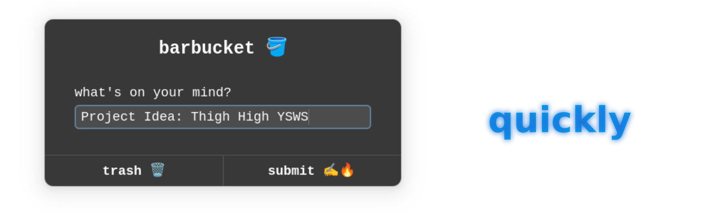

# barbucket
A utility for catching thoughts before they skitter away



[Link to SoM Project](https://summer.hackclub.com/projects/10799)

I commonly find myself thinking of clever and nonsenical one-liners and I wanted a way to store them, so I decided to make a program that could be opened quickly whenever I got one of these thoughts. I want to keep it simple and adaptable, and just dump all thoughts into a text file.

## Dependencies
- bash
- zenity
- xsel

## Setup

Installing dependencies:
```shell
sudo apt update
sudo apt install zenity xsel
```

Cloning the repo:

### With `git pull`
```shell
mkdir -p ~/.barbucket/.app/
cd ~/.barbucket/.app/
git clone https://github.com/IMakeThingsWithCode/barbucket.git
chmod +x ./barbucket/shortcut ./barbucket/shortcut
```

### Downloading via GitHub release (not recommended)
1. Go to the [GitHub releases](https://github.com/IMakeThingsWithCode/barbucket/releases/latest)
2. Download both the scripts (`barbucket` and `shortcut`)
3. Put both scripts in `~/.barbucket/.app/barbucket/` (create the directories manually or with the command `mkdir -p ~/.barbucket/.app/barbucket/`)
4. Run `chmod +x ~/.barbucket/.app/barbucket/*`

---

If you use this guide for setup, it will install both scripts to `~/.barbucket/.app/barbucket/`.
By default, collections will be located at `~/.barbucket/`, and you can open the collections at any time with a standard file viewer or text editor.

Running:
- Application (viewer) run `~/.barbucket/.app/barbucket/barbucket`
- Shortcut (quick add) run `~/.barbucket/.app/barbucket/shortcut`

## You should bind the `shortcut` script to a key!
Obviously the purpose of this script is mostly defeated if you have to open a terminal and run the script through it every time, so it's recommended to use your shortcut management script of choice to bind a key combo to run `~/.barbucket/.app/barbucket/shortcut`.

## Usage
This repo contains two seperate scripts. The main one is `shortcut`, and the other one (`barbucket`) is just a viewer. `barbucket` can be used, but you could also just use a text editor.
### shortcut (quick add)
1. Run tool
2. Write a thought
3. Select a collection to save the thought to
### barbucket (collection viewer)
1. Save thoughts with other tool
2. Run this tool
3. Select a collection
4. View thoughts in selected collection
5. Copy one of the thoughts or exit

## Uninstalling
```shell
rm -rf ~/.barbucket/
```

You can also remove dependencies with
```shell
sudo apt remove zenity xsel
```

## Commandline Args
Pass the location of a collection to the `f` flag of `shortcut` and it will save there without prompting. Similarly, you can pass a thought to the `t` flag and it won't prompt for the thought.

## Todo
- [x] First prototype
    - [x] Can be keybound
    - [x] Prompts for thought
    - [x] Dumps thought to text file
- [x] GUI update
    - [x] Pick save location, like pinterest
        - [x] Divide into collections, one file per
- [x] Thought viewer for collections
    - [x] Select collection
    - [x] Thought actions
        - [x] View
        - [x] Copy
- [x] Write setup guide
    - [ ] Test on another device / fresh install